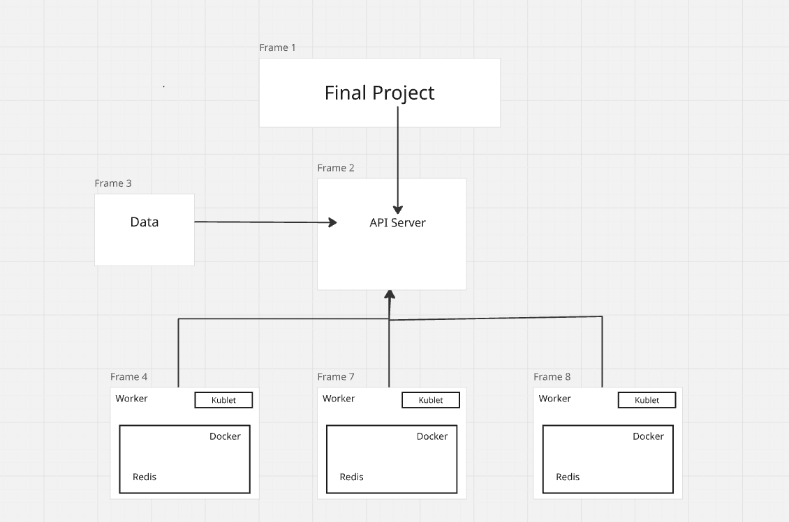

# COE 332 Final Project: Space Launches API & Kubernetes Pipeline

## Overview
The **Space Launches Data API** is a containerized microservice suite that:

1. **Fetches & normalizes** the Kaggle “One Small Step for Data” Global Space Launches CSV, handling header quirks and imputing missing rocket counts.

2. **Caches** every launch record in Redis (db 0) for low-latency access.

3. Exposes a **Flask REST API** to load (/data), query (GET /data), and delete (DELETE /data) launch records.

4. Provides a suite of analysis endpoints—/analyze/timeline, /analyze/sector, /analyze/geography, and /analyze/top-private—which **enqueue jobs** for background processing.

5. Offers a **Jobs API** (/jobs/<job_id>) so clients can poll job status and a **Results API** (/results/<job_id>) to download the generated PNG plots.

6. Runs a **Worker** service that pulls tasks off a Redis list (db 1), updates job metadata (db 2), runs the appropriate plotting routine (timeline crossover, sector bar, geographic heatmap, top-private bar), and stores the raw PNG bytes in Redis (db 3).
---

## Introduction  
We provide a containerized Flask+Redis API for ingesting, normalizing, and analyzing a global space-launches dataset.  Users can submit background jobs to generate **timeline**, **sector**, **geography** and **top-private provider** plots— then download the resulting PNGs.

---

## Data Preparation  
1. **Kaggle CSV**: “One Small Step for Data” Global Space Launches (https://www.kaggle.com/datasets/davidroberts13/one-small-step-for-data)  
2. **Kaggle API Token**:  
   - Copy your `kaggle.json` token into `~/.kaggle/kaggle.json` (inside your VM or Docker host).  
   - Lock down permissions:  
     ```bash
     chmod 600 ~/.kaggle/kaggle.json
     ```  
3. **Columns of Interest**:  
   - `Year`, `Private or State Run` (P/S), `Company Name`, `Country of Launch`, `# Rocket`  

---

## Architecture Diagram  


---

## Key Technologies  
- **Docker & Docker Compose** for local container orchestration  
- **Flask** for REST API endpoints  
- **Redis** (db 0…3) for record storage, job queue, metadata, and result caching  
- **Pandas & Matplotlib** for data cleaning and static plotting  
- **Kubernetes** manifests (in `kubernetes/`) for future production rollout  

---

## Project Overview

This project performs the following operations:

1. **Space Launch Data Handling:**  
   - Downloads (via Kaggle API) or reads a local CSV of global space launches.  
   - Normalizes headers (strips whitespace), imputes missing `# Rocket` values, and resolves “Sea Launch” entries.  
   - Caches every launch record in Redis (db 0) for fast retrieval.  
   - Exposes endpoints to load (`POST /data`), list (`GET /data`), and delete (`DELETE /data`) launch records.

2. **Jobs API:**  
   - Provides analysis endpoints that enqueue background jobs for plotting:  
     - `/analyze/timeline` (crossover analysis)  
     - `/analyze/sector` (private vs. state bar chart)  
     - `/analyze/geography` (country heatmap)  
     - `/analyze/top-private` (top-10 private providers)  
   - Each job is assigned a UUID and stored in Redis (db 1 as a list, db 2 for metadata).  
   - Clients poll `/jobs/<job_id>` to check status and `/results/<job_id>` to download the resulting PNG.

3. **Worker Integration:**  
   A dedicated worker process continuously:  
   - BLPOPs a job ID from Redis db 1, marks it “in progress” in db 2.  
   - Loads the full launch cache from Redis db 0.  
   - Runs the appropriate plotting function (`plot_private_crossover`, `plot_sector`, `plot_geography`, or `plot_top_private`).  
   - Stores the raw PNG bytes under `results:<job_id>` in Redis db 3 and marks the job “complete” in db 2.


| Route                      | Method | Description                                                                              |
| -------------------------- | :----: | ---------------------------------------------------------------------------------------- |
| **`/help`**                |   GET  | List all endpoints and usage.                                                            |
| **`/data`**                |   GET  | Get all records (seeds from Kaggle CSV if empty).                                        |
|                            |  POST  | Upload CSV (`file`) or JSON array/object to seed/append records.                         |
|                            | DELETE | Delete all records.                                                                      |
| **`/analyze/timeline`**    |  POST  | Enqueue crossover analysis: marks the first year private launches exceed state launches. |
| **`/analyze/sector`**      |  POST  | Enqueue sector comparison: bar chart of private vs. state launches.                      |
| **`/analyze/geography`**   |  POST  | Enqueue geographic analysis: heatmap of launches by country.                             |
| **`/analyze/top-private`** |  POST  | Enqueue top-private job: top 10 private launch providers (1995–2020).                    |
| **`/jobs/<job_id>`**       |   GET  | Query job status & metadata (`queued`/`complete`, type, `result_ready` flag).            |
| **`/results/<job_id>`**    |   GET  | Download the PNG bytes for a completed job.                                              |


## Main Files

- **api.py**  
  The Flask application that defines all HTTP endpoints:  
  - **`/help`** — Lists every route and usage.  
  - **`/data`** — `POST` to seed or append launches, `GET` to list all records, `DELETE` to clear the dataset.  
  - **`/analyze/timeline`**, **`/analyze/sector`**, **`/analyze/geography`**, **`/analyze/top-private`** — Enqueue background analysis jobs.  
  - **`/jobs/<job_id>`** — Query job status and metadata.  
  - **`/results/<job_id>`** — Download the PNG result for a completed job.

- **jobs.py**  
  Defines the job‐management functions used by both `api.py` and `worker.py`:  
  1. `create_job(job_type)` – generates a UUID, stores metadata in Redis db 2, and pushes the job ID onto the queue (db 1).  
  2. `get_job(job_id)` – retrieves status/type/parameters from Redis db 2.  
  3. `job_result_ready(job_id)` – checks for a result entry in Redis db 3.  

- **launches_reader.py**  
  Handles CSV ingestion and Kaggle API fetch:  
  1. Reads a local file‐like or downloads+unzips the Kaggle dataset.  
  2. Strips whitespace from headers, converts “# Rocket” to numeric and imputes missing values.  
  3. Returns a list of JSON‐serializable records for storage in Redis.

- **worker.py**  
  The background‐worker process that:  
  1. Uses `BLPOP` on Redis db 1 to retrieve job IDs.  
  2. Marks jobs “in progress” in Redis db 2.  
  3. Loads cached launch records from Redis db 0.  
  4. Dispatches to one of four plotting functions (`plot_private_crossover`, `plot_sector`, `plot_geography`, `plot_top_private`).  
  5. Stores the PNG bytes under `results:<job_id>` in Redis db 3 and marks jobs “complete” in db 2.

- **Dockerfile**  
  Builds a single image for both the API and worker:  
  - Base: `python:3.12-slim`.  
  - Installs dependencies from `requirements.txt`.  
  - Copies `src/` code in and sets `WORKDIR` to `/app/src`.  
  - Exposes port 5000 and defaults to running `python api.py`.

- **docker-compose.yml**  
  Orchestrates three services:  
  - **`api`** (builds the Dockerfile, runs `python api.py`, exposes port 5000)  
  - **`worker`** (same image, runs `python worker.py`)  
  - **`redis`** (official Redis 7 image, with persistent volume)

- **pytest.ini**  
  Configures pytest to discover tests in the `test/` directory and apply any custom markers.

- **test/**  
  Contains unit & integration tests:  
  - `test_api.py` verifies all Flask endpoints (`/data`, `/analyze/*`, `/jobs/*`, `/results/*`).  
  - `test_worker.py` verifies each plotting function returns valid PNG bytes.

- **kubernetes/**  
  Contains two environment folders `prod/` and `test/` each with 8 Kubernetes manifest files (Deployments, Services, PVCs, and Ingresses) for rolling out the Redis cache, Flask API, and Worker components on a cluster.

- **Makefile**
  Provides convenient commands to build the Docker images, start and stop the Docker Compose services, view logs, and run the test suite against the live Redis-backed API.
  - Use command: ```make all``` to run all commands at once.


## Unit Tests

We now maintain three test suites under `test/` that validate every layer of our application:

- **`test_api.py`**  
  - Verifies all Flask endpoints (`/help`, `/data`, `/analyze/timeline`, `/analyze/sector`, `/analyze/geography`, `/analyze/top-private`, `/jobs/<job_id>`, `/results/<job_id>`).  
  - Spins up the app in `TESTING` mode and exercises CRUD and job‐enqueueing workflows against a real Redis instance.

- **`test_jobs.py`**  
  - Exercises the core job‐management functions in `jobs.py`:  
    - `create_job()`, `get_job()`, status transitions, and `job_result_ready()`.  
  - Uses a mocked or local Redis server to confirm metadata is stored and the queue is pushed correctly.

- **`test_worker.py`**  
  - Validates each plotting routine—`plot_private_crossover()`, `plot_sector()`, `plot_geography()`, and `plot_top_private()`—returns valid PNG bytes (checks the PNG magic header).  
  - Runs against small in‐memory DataFrames and record lists.

---

### Running the tests

1. **Start Redis** (in a separate terminal or background):
   ```bash
   cd test
   redis-server --daemonize yes
2. **Configure the Environment**
   ```bash
   export REDIS_HOST=127.0.0.1
3. **Run Pytest**
   ```bash
   python3 -m pytest

You should see output like this: 

```bash

collected 12 items
test_api.py ......               [ 50%]
test_jobs.py ...                 [ 75%]
test_worker.py ...               [100%]

12 passed in 1.23s
```

## Data Description

The data powering this API comes from the Kaggle “One Small Step for Data” Global Space Launches dataset. Each record corresponds to a single launch event and includes fields such as:

- **Company Name**: The launch provider (e.g. SpaceX, Arianespace, Sea Launch).  
- **Location**: Text description of the launch site (e.g. “LC-39A, Kennedy Space Center, Florida, USA”).  
- **Detail**: Mission or payload description (e.g. “Falcon 9 Block 5 | Starlink V1 L9 & BlackSky”).  
- **Status Rocket**: Rocket status code (e.g. Active, Retired).   
- **Status Mission**: Mission outcome (Success, Failure, Partial).  
- **Country of Launch**: Nation or territory from which the launch occurred (e.g. USA, Russia, Kazakhstan).  
- **Company’s Country of Origin**: Country where the launch provider is headquartered.  
- **Private or State Run**: “P” for private companies, “S” for state/government operators.  
- **DateTime**: ISO-style timestamp of the launch event.  
- **Year**, **Month**, **Day**, **Date**, **Time**: Parsed date/time components for easy grouping and plotting.

> **Normalization Notes**  
> - We strip whitespace from all column names (the raw “\# Rocket” header included leading/trailing spaces).  
> - We convert “\# Rocket” to numeric and fill missing entries with the median count.  
> - We resolve ambiguous “Sea Launch” entries by treating “Sea Launch” only as a company and mapping any stray country entries to their correct geographic parent.

**Data Source Citation:**  
Kaggle dataset “One Small Step for Data: Global Space Launches” –  
https://www.kaggle.com/datasets/davidroberts13/one-small-step-for-data  

## Building and Launching All Containers

1. **Prerequisites**  
   - Docker ≥ 20.x  
   - Docker Compose ≥ 1.29  

2. **Build & Launch**  
   From the project root (where your `docker-compose.yml` lives), run:
   ```bash
   docker compose up --build

This command will:

- Build a single Docker image (based on a Python 3.12-slim base) that installs all required Python dependencies (`Flask`, `requests`, `pandas`, etc.) from `requirements.txt`.

- Copy your application code (`api.py`, `worker.py`, `launches_reader.py`, `jobs.py`) into the container.

- Configure two services that use this image:

   - api → runs `python api.py` and exposes port 5000

   - worker → runs `python worker.py` in the background

- Spin up a third service:

   - redis → the official `Redis 7` image, used for data storage and job queueing

3. **Verify**

```bash
docker ps
```

You should see three containers:

- `space_launches-api-1` (Flask API on port 5000)

- `space_launches-worker-1` (background job processor)

- `space_launches-redis-1` (Redis server)

4. **Inspect Logs**

To confirm the API started correctly, view its logs:

```bash
docker compose logs api
```

Upon running this command, you should see something like:

```bash
* Running on all addresses (0.0.0.0:5000)
```

This indicates that your API is live at port `5000`.

## Deploying Kubernetes

### Build/Load Images

```
docker build -t space_launches_api:1.0   -f Dockerfile .
docker build -t space_launches_worker:1.0 -f Dockerfile .
```

### Deploy Manifests

- Prod
    ```kubectl apply -f kubernetes/prod/```
- Test
    ```
    kubectl create namespace test
    kubectl apply -n test -f kubernetes/test/
    ```

### Verify Resources

- Prod
    ```kubectl get pvc,pods,svc,ingress```
- Test
    ```kubectl get pvc,pods,svc,ingress -n test```

### Smoke-test the API (Example Usage)
    1. Port-forward Flask
    ```kubectl port-forward svc/flask-service 5000:80```
     
    2. ```curl http://localhost:5000/help``` (in another shell)
    
    3. Seed a record 
    ```curl -X POST http://localhost:5000/data \
     -H "Content-Type: application/json" \
     -d '[{"Company Name":"PodTest","Year":"2025","Private or State Run":"P"}]'```
    
    4. List it back
    ```curl http://localhost:5000/data | jq .```
    
    5. Submit & fetch a plot 
    ```JOB=$(curl -s -X POST http://localhost:5000/analyze/timeline | jq -r .job_id)
    sleep 5
    curl http://localhost:5000/results/$JOB --output timeline.png```

### Persistence Check
```kubectl delete pod -l app=flask-app
   sleep 5
   curl http://localhost:5000/data```

**Kubernetes cluster did not work on our VM as we apparently do not have cluster-admin rights to create Deployments, Services, PVCs, or Ingresses, but if we did, we would go about using the steps outlined above**


## Example API Query Commands and Expected Outputs

Once your containers are running on port 5000, use the following `curl` commands to exercise each endpoint. Replace `<JOB_ID>` with the UUID returned by the POST requests.

### 1. Data Operations

- **Load the full dataset**  
  ```bash
  curl -X POST http://localhost:5000/data

Expected Output:
```bash
{"status":"success","count":4278}
```

- List all Records:
```bash
curl -X GET http://localhost:5000/data
```
Expected Output: 
```bash
[
  {
    "id":"a1b2c3d4",
    "Company Name":"SpaceX",
    "Year":"2020",
    "Rocket":50,
    "Country of Launch":"USA",
    …
  },
  …
]
```
- Delete all records

```bash
curl -X DELETE http://localhost:5000/data
```

Expected Output: 
```bash
{"status":"all records deleted"}
```
### 2. Enqueue Analysis Jobs

- Timeline (crossover) analysis
```bash
curl -X POST http://localhost:5000/analyze/timeline \
     -H "Content-Type: application/json" -d '{}'
```
Expected Output:
```bash
{"job_id":"<JOB_ID>"}
```

- Sector comparison analysis
  
```bash
curl -X POST http://localhost:5000/analyze/sector \
     -H "Content-Type: application/json" -d '{}'
```
Expected Output: 
```bash
{"job_id":"<JOB_ID>"}
```

- Geographic analysis

```bash
curl -X POST http://localhost:5000/analyze/geography \
     -H "Content-Type: application/json" -d '{}'
```

Expected Output: 
```bash
{"job_id":"<JOB_ID>"}
```

- Top-private providers (1995-2020)
  ```bash
  curl -X POST http://localhost:5000/analyze/top-private \
     -H "Content-Type: application/json" -d '{}'
  ```

Expected Output: 
```bash
{"job_id":"<JOB_ID>"}
```
  
### 3. Job Status & Donwnloading Results

- Check a job's status

```bash
curl -X GET http://localhost:5000/jobs/<JOB_ID>
```

Expected Output:

```bash
{
  "id":"<JOB_ID>",
  "type":"timeline",
  "status":"complete",
  "result_ready":true
}
```

- Download the plot/image

```bash
curl -X GET http://localhost:5000/results/<JOB_ID> --output timeline.png
```
Expected Output:

```bash
Binary PNG data written to timeline.png
```

## Conclusion

We’ve demonstrated a fully containerized pipeline for ingesting, storing, and analyzing space-launch data via simple HTTP calls. Future improvements could include an interactive web dashboard and GeoPandas-based choropleth maps for richer geospatial insight.

## Note on Using AI 

CHATGPT was used to write parts of this README.


  


